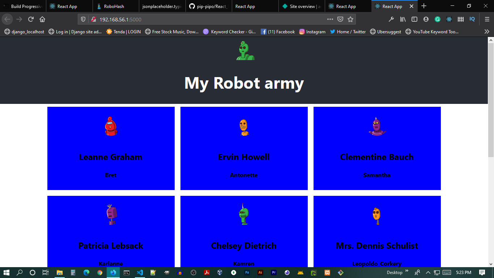

## ✔▶little React PWA Project

### Fell free to give a start 😊


## [Api end point Link](https://robohash.org/d.png?size=200x200)

## Build Version in Netlify
[https://robot-army-pwa.netlify.app/](https://robot-army-pwa.netlify.app/)


# start with
```
npm start
or
yarn start
```


# Dependencies
```
{
  "name": "my-app",
  "version": "0.1.0",
  "private": true,
  "dependencies": {
    "@testing-library/jest-dom": "^5.11.9",
    "@testing-library/react": "^11.2.3",
    "@testing-library/user-event": "^12.6.0",
    "react": "^17.0.1",
    "react-dom": "^17.0.1",
    "react-scripts": "4.0.1",
    "styled-components": "^5.2.1",
    "web-vitals": "^0.2.4",
    "workbox-background-sync": "^5.1.4",
    "workbox-broadcast-update": "^5.1.4",
    "workbox-cacheable-response": "^5.1.4",
    "workbox-core": "^5.1.4",
    "workbox-expiration": "^5.1.4",
    "workbox-google-analytics": "^5.1.4",
    "workbox-navigation-preload": "^5.1.4",
    "workbox-precaching": "^5.1.4",
    "workbox-range-requests": "^5.1.4",
    "workbox-routing": "^5.1.4",
    "workbox-strategies": "^5.1.4",
    "workbox-streams": "^5.1.4"
  },
  "scripts": {
    "start": "react-scripts start",
    "build": "react-scripts build",
    "test": "react-scripts test",
    "eject": "react-scripts eject"
  },
  "eslintConfig": {
    "extends": [
      "react-app",
      "react-app/jest"
    ]
  },
  "browserslist": {
    "production": [
      ">0.2%",
      "not dead",
      "not op_mini all"
    ],
    "development": [
      "last 1 chrome version",
      "last 1 firefox version",
      "last 1 safari version"
    ]
  }
}

```


